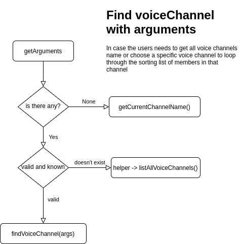

# discord-bot

 As a communication improvement there was a lack of arrangement on who starts speaking at the discord channel. Any kind of sorting would fit.

- Log to the discordApp server through api
- Listen to changes with the prefix `!daily` 
- get all members inside a specific channel
- run those users through a random sort algorithm
- return list of members to discordApp client

 After [adding]([asd](https://discordapp.com/developers/applications/))  the bot to the server. Run the index.js to attend to all requests made to the bot.

 Must insert config.json file. The token is set at the [Bot manager](https://discordapp.com/developers/applications/)
 ```
 {
     prefix: '!',
     token: 'T0sQ...'
 }
 ```

To get Channel and Members ID's it's necessarly to run discordApp with <b>developers mode</b>, and right click to access the element.


#### Arguments feature 
If you  want to specify which VoiceChannel to sort the list of members
```
!daily --<voiceChannel name>
!daily --b2c
```

<p align="center">
  
</p>


#### to-do
 - Get the Channel dynamically from who triggered the request
 - set <b>Preferencial users</b> to be along side when executing the sorting algorithm 
 - Exclude member parameter to not include a member in the sorting list
